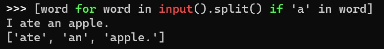
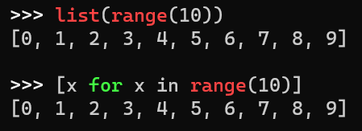
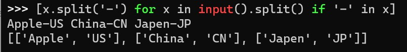

# 列表操作


---

## 目录


*以后补*

---

### 列表的样子


列表在 Python 里面是一个**特别特别重要**的一种类型

以至于我们学到后面学到的列表甚至不是 Python *内置的列表类型*  (这么说其实也是有点问题的)了


首先我们先看看列表的基本结构

```python
a = [1, 'a', None, True, [], [1,2], (1,2), print]
```

虽然它特别的长，看起来很吓人，但是我们也能从中获得一些关于列表的知识

- 列表里面可以是**任意的Python对象**
- 列表是**可以嵌套**的，也就是列表里面可以再放一个列表


那么我们已经好像明白了列表的**基本构造**

一个`[`再加上另一个`]`括起来的就是列表，加一点佐料(数据)在里面，就构成了列表


既然已经大概知道了是怎样一个东西，那怎么去使用呢？都说是一个**特别厉害**的也**特别**

**重要**的类型，那使用它是不是很难啊？

答案是：~~是的~~不是的啊

虽然重要，但是使用它还是很简单的~，不过是方法多了一些


---

### 列表索引

既然不难，我们先看看最最基础的使用方式


*以后补*

---

## 列表推导式


可能聪明的你已经发现了这个标题比前面大一些，没错，因为这个很重要


首先上代码

```python
sentence = input()
words_with_a = []

for word in sentence.split():
    if 'a' in word:
        words_with_a.append(word)

for word in words_with_a:
    print(word)
```

代码很清晰，简单思索一下，这段代码主要功能是：

​	输入一个句子

​	输出里面所有有字母`a`的单词

那我们先直接看看用**列表推导式**怎么写的

```python
words_with_a = [word for word in input().split() if 'a' in word]
# 然后输出它
```

咋一看，好长。没事我们拆开来单独看看

`input().split()`：这个是把输入的句子，按空格分割开来( 还记得 `str.split` 的用法嘛)

```python
>>> 'I ate an apple.'.split()
['I', 'ate', 'an', 'apple']
```

`if 'a' in word`：这个看起来像是一个`if`的判断

`word for word in input().split()` ：这个应该是一个循环，然后结合刚才的分析，这里的`word`应该是符合`if`条件的`word`

至此，先好好想一想先。


那综上，`[word for word in input().split() if 'a' in word]`这个列表里面的内容应该是

​	在`input().split()`所返回的列表中所有符合`'a' in word`的`word`

那我们运行看一下我们分析的对不对



**!** 我们是对的哦，所以我们好像大致可以先看看列表推导式看起来的结构

`[变量 for 变量 in 可迭代对象 条件]`

到现在，应该这个给我们的感觉并不是很难的样子，如果还觉得有点难，我们可以多多多多[**看几遍**](https://www.bilibili.com/video/BV1b54y117KG/?spm_id_from=333.337.search-card.all.click&vd_source=5a9f8467ab298c2164adb10694013388)

开玩笑的，我们现在看一看简单一点的推导式

​	`[x for x in range(10)]`

有没有深感熟悉又不知从何说起

那我们看看这个图片



仔细观察一下，发现好像推导式也不是什么事嘛


然后就是，其实它还有一个我们所遗漏的地方，其实它是可以对筛选出来的变量进行一下简单的处理的

观察这一行

`[x.split('-') for x in input().split() if '-' in x]`

**好复杂**，先分析 ，*好啦分析完啦*

那这行代码呢，完成以下三个操作

- 把输入的一长串字符串以**空格**` `分割成一个列表
- 筛选我们需要的元素，条件是每个元素中 (此时是字符串) 里面有`-`
- 把筛选出来的每个元素都以 `-` 分割成一个个**嵌套**在大列表里面的小列表

看看运行结果



*~~观察一下相信聪明的你一定是能看明白的！~~* 

那其实很重要的东西也并不会很复杂，分析每一行，每一小小段，是可以明白具体的含义的


---

###### 一道小小的有关列表推导式的题目

好啦上题目，我们在题目里面看一下怎么具体去使用列表推导式

```
- 输入若干个数，以逗号间隔，计算平均数并将其输出
```

输入格式/样例

`12,64,74`

输出格式/样例

`50`

---

简单的看过，我们先简单的写一下

```python
nums = []
raw = input().split(',')

for num in nums:
    nums.append(eval(num))

ave = sum(nums)/len(nums)
print(ave)
```

然后我们用上列表推导式

```python
nums = [eval(num) for num in input().split(',')]
ave = nums/len(nums)

print(ave)
```

是不是少了好多好多（在一些复杂的场景可以减少的更多)，当然使用推导式的**本质目的**，确实减少代码量，也就是写的少一点

不过不是一昧的减少，而是要**保持可读性**的前提下减少可以减少的代码量！


*推导式就应该就就没有了吧*

---


