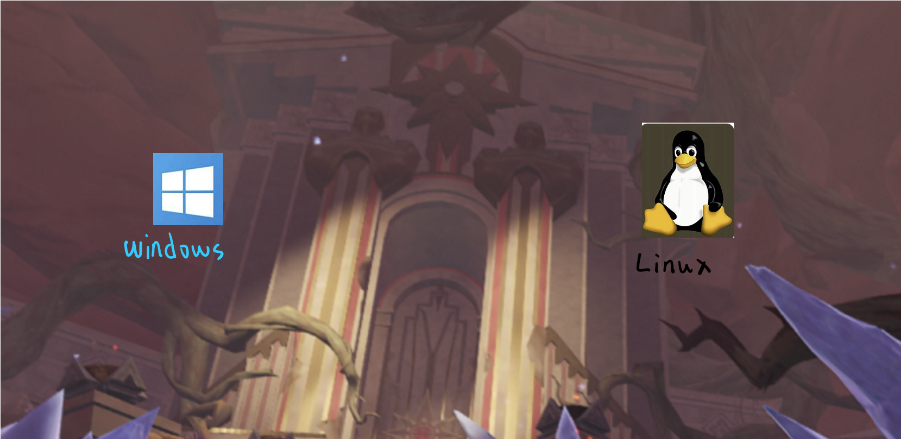

# AL


---

## 目录


[前言](##前言)

​	[一些词语](###一些会遇到的词)

​	[一些工具](###一些小工具)

​	[一些准备](###一些准备)

[Python](./Python/index.md)

​	[前言](./Python/index.md/##前言)

​	[Cap1-基本](./Python/index.md/##Cap1-基本)


*以后补*

----

## 前言


学程序不仅仅学学怎么写程序，还有其他的内容

例如怎么用一些比较简单的命令行，写一些简单的脚本

还有环境变量呀，还有一些基本工具和一些常见问题的解决方案


那现在呢目前的规划是

- 一些基本的小知识
- 一些命令行/工具的基本使用方法

然后就是一些编程的心得，预计有 C/C++ 和 Python


接着呢，我们即将要推开计算机的大门，在大门外面，有两个大大的图案



可能已经发现了这是两个操作系统，一个是 Windows，一个是Linux

是的你已经发现啦，这把我的苹果，也就是MacOS。其实我并没有省略掉它，所以让我们现在来认识一下这些系统

- Windows

  这个大家都很熟悉，就是市场占有率最最最高的系统，这个就不做多介绍了

- UNIX & Linux

  这个并不在计算机的大门上，可是我还是写在这里了，如果时光倒退，Linux现在的位置其实是这个系统的，也就是UNIX

  可是为什么它现在落寞了呢(bushi) 这就要简单的介绍一下Linux的由来

  上个世纪呢，苹果，微软，UNIX三家独大，他们有一个共同特性，就是 **要钱**！！！

  那LInux这个人呢，就不干了，手撸了一个系统，取名为Linux，是的，这就是Linux操作系统的由来

  那么，苹果电脑的MacOS呢，就是基于UNIX开发的，所以它算是UNIX的一个衍生版

  

  那现在Linux和UNIX是**什么关系嘞**

  从某种角度来说，UNIX就是Linux(说的不对但不要骂我)

  (这一部分以后还会讲到)


PS:

​	那可能有人会问```我还听过一下操作系统，Ubuntu, Kali等，他们算什么？```

​	他们都是Ubuntu的**衍生版**，何为衍生版，可以理解为孩子和父母的关系

​	诚然Linux是一个操作系统，不过单一个Linux和Windows比较还是有一点简陋，

​	比如没有图形化的界面，只能对着黑乎乎的窗口，那衍生版，就是给Linux穿上好看

​	的衣服，让它的一些功能能让我们更直观简便的利用，这就是衍生版主要的作用。

​	

*以后补*

---

### 一些会遇到的词


会**慢慢慢慢**的更新，因为有好多好多词语可能会遇到，不过这里这里罗列一些

我认为现阶段比较常用的词语


- 命令行

  就是一个黑乎乎的窗口

  

- 包管理器

  我们知道我们手机上下载软件，可以应用商店，可以去网络上下载。而在电脑上下载软件，不同的系统也有对应的软件商城或者直接去网络上下载。去网络上下载，有的软件十分的方便，有的软件找来找去都找不到正版或者是官网。

  那么，**包管理器**，闪亮登场，```包```可以理解为软件的意思。这个包管理器，就是提供了一个类似于应用商城的功能。下载/更新/卸载软件更方便啦！


*以后补*

---

### 一些小工具


- [Chocolatey](https://chocolatey.org/)

这个是一个Window下的包管理器


*以后补*

---

### 一些准备

