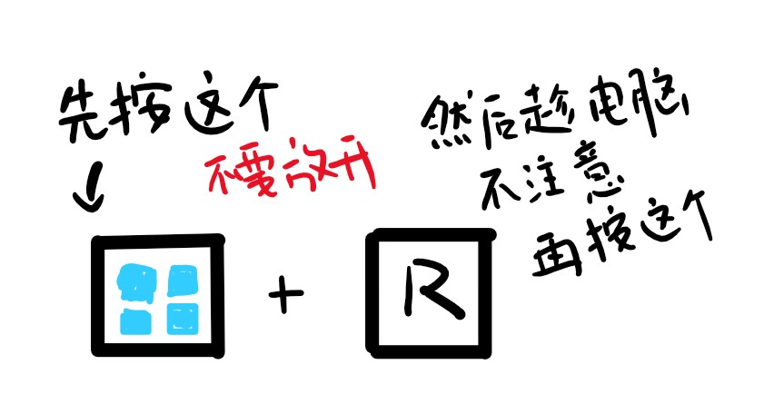
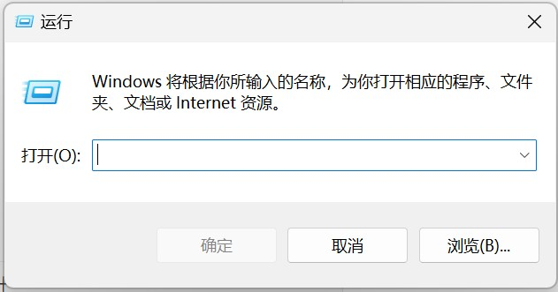
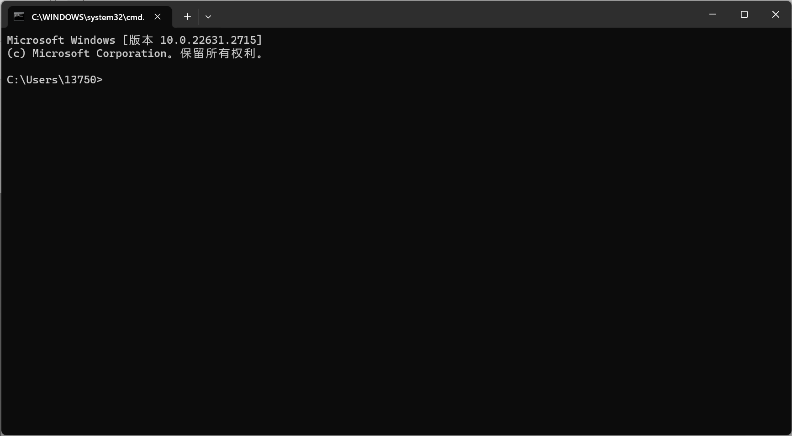
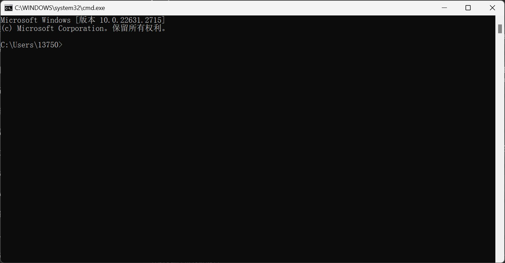
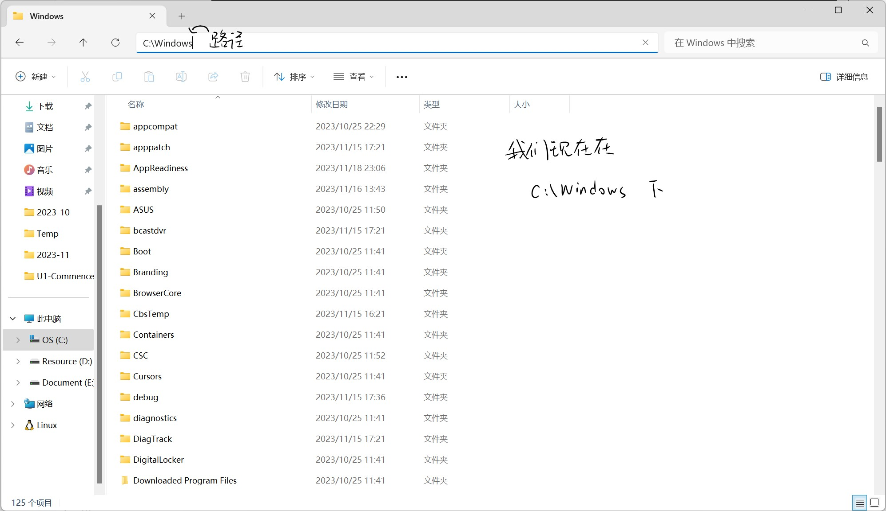

# 一些基本操作

---


## 目录


[前言](##前言)

[cmd](##cmd)

- [help](######help)


---

## 前言


这里这个嘞是主要讲一讲Windows下**cmd**，**环境变量**等等的一些操作


---

## cmd

Windows下嘞有个黑乎乎的工具，我知道它可以是好多样子，我们只讨论最开始的模样，然后一步步的让它变得好看

首先我们看到键盘，有好多好多按钮。我们找到有Windows图标的那个按钮, 按住，然后再按```R```



然后就可以看到这个



输入```cmd```然后回车，就可以看到这个窗口啦



但是可能有的人并不是这个样子，别急，它确实还有另一个样子



本质上嘞，这俩没区别，不过更上面一点的好看些，它们是可以互相切换的，这一个以后会讲到


那这里有几个元素，我们来看看啥意思

`13750`：是我的用户名，那每个人都不一样，那这个就是每个人的用户名

`C:\Users\13750`：是当前所在路径，路径，顾名思义就是在系统的哪里

打开文件夹



明白什么是路径了吧~

###### help

现在我们先尝试输入`help`，然后回车，看看会发生什么

然后然后，就是学习我认为学习编程最最重要的！好奇心

没错，先自己探索一下吧~