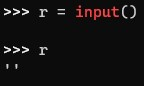

# IO in Python


---

这次来讲讲输出入


---

###### 1.1

输入若干行，每行一个名字，直到一个空行停止，下面是输入样例

```
张三
王五
李四
文杰

```


很明显我们不知道一共有几行，所以要不断地输入，我们很容易联想到`while`

```python
names = []
tmp = input()
while tmp:
    names.append(tmp)
    tmp = input()
```

当我们使用`input`的时候，输入一个空行，也就是直接敲回车，得到的内容并不是`\n` 或者是`os.sep`定义的换行符，而是一个**空字符串**！



那么换一种说法，直接敲回车 `input()`返回的值是`False`的！

所以我们才能用`while`后面的循环条件来界定我们是否已经不用读取了（也就是读取了一个空行）

不过，上面的代码，似乎还有有一点累赘，写了两次`tmp = input()`， 或者你可能会说

用`while True`就可以只用一次了！没错，你是对的，但还有更简洁的

```python
names = []
while tmp:=input():
    names.append(tmp)
```

哦吼吼，这个好像看上去很高级，又好奇怪

认识一下

`:=` ， 横过来看，像一只海象，所以它的名字是**海象运算符**。

有什么用呢？我们知道，赋值操作是一个语句，但和函数调用不同，**函数调用会返回一个值**，而赋值操作是不会的

所以我们不能这么写：

```pyt
x = (tmp = input())
```

那么**海象运算符**就可以解决这个问题，它可以让赋值的同时，让这个赋值语句变成一个表达式，值就是赋值的值，有点拗口

```python
x = (tmp := input())
```

这个语句，先是输入，把输入的值赋值给`tmp`，然后`(tmp := input())` 等价替换为输入的内容，赋值给`x`


---

###### 1.2

再看看其他的输入

 ```
 第一行输入一个整数，表示商品的个数；接下来分行输入n个商品名称和价格。
 ```

输入样例

```
4
方糖
99
X1
499
魔盒
399
曲奇
299

```

那么的话，我们可以用字典，或者列表来存储这些数据，这里我们选择列表

上代码

```python
n = eval(input())
db = [(input(), eval(input())) for _ in range(n)]
```

这里的`_`是什么意思呢？我们看到，有`n`行，xunhuan`n`次，但是`range(n)`的每次迭代出来的值我好像用不到，

那么`_`的意思是占位，**语法需要但是我不需要的意思**


当然我们可以用`字典推导式`

```python
n = eval(input())
db = {input(), eval(input()) for _ in range(n)}
```


---

###### 1.3

还有一种情况是输入一行，但是有好多东西的情况


##### 输入样例#1

转存为列表

```
[1,2,3,4,5]
```

已经是列表的格式了，那直接`eval`

```python
raw = eval(input())
```


##### 输入样例#2

转存为列表

```
1, 2, 3, 4, 5
```

这个不是列表的样子，那首先我们要依次读取，然后把每一项改为数字

```python
raw = [eval(i) for i in input().split(',')]
```

列表推导式十分的重要，这里不再赘述

`str.split(',')`把整个输入行以`,`为分界截成列表，再用`eval`转化


